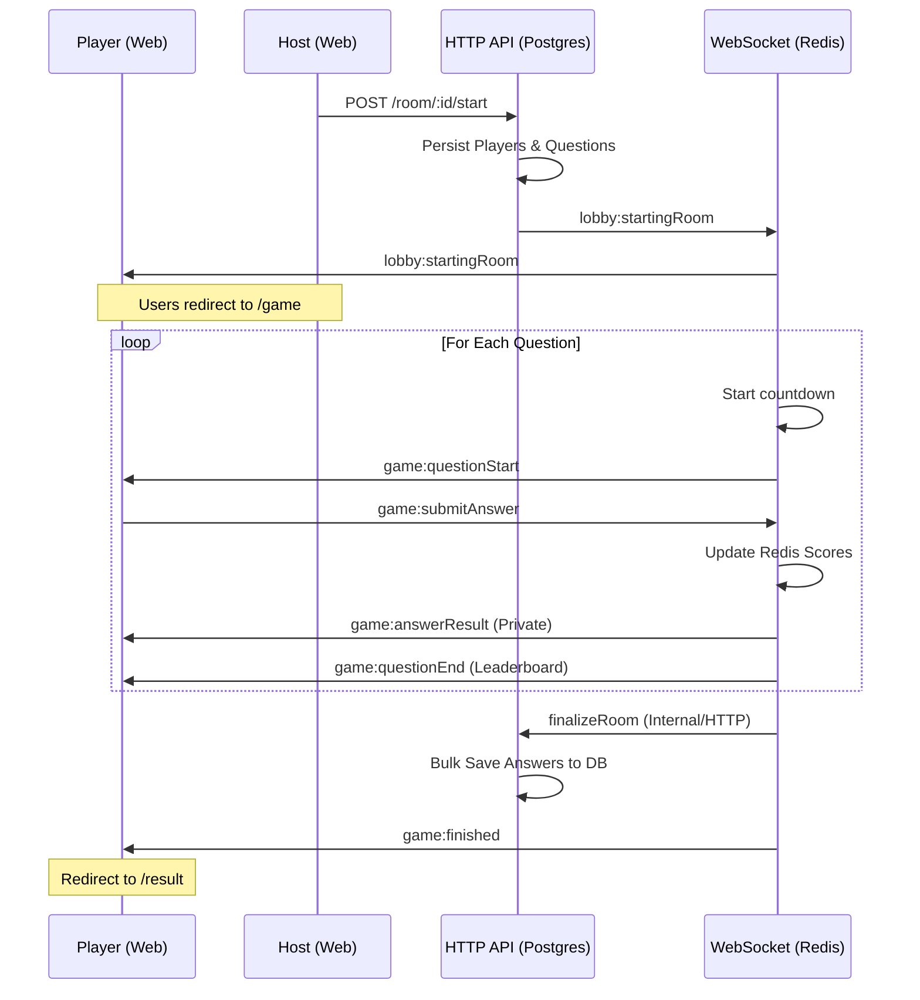

# QuizMaster: Full Game Flow & Backend Architecture

This document explains how the multiplayer quiz system works, from the moment a room is created to the final result analysis.

## 1. High-Level Architecture

We use a **Hybrid Architecture**:

- **HTTP (PostgreSQL)**: Handles persistent data, authentication, and room setup.
- **WebSocket (Redis)**: Handles real-time gameplay, sub-second scoring, and active game states.

---

## 2. Step-by-Step Flow

### Phase A: Setup & Lobby

1. **Create Room (HTTP)**
   - **Step**: Host selects a quiz and clicks "Create Room".
   - **Backend**: `createRoom` controller inserts a `Room` record in Postgres with `state: CREATED`.
2. **Join Lobby (Socket)**
   - **Step**: Players join the lobby via the URL.
   - **Backend**: `lobby.service.ts` is triggered. It stores player info (Name, Avatar) in a Redis hash: `room:[roomId]:players`.
   - **Event**: `lobby:playerJoined` notifies others.

### Phase B: Game Initiation (The Bridge)

1. **Start Game (HTTP Trigger)**
   - **Step**: Host clicks "Start Game" in the UI.
   - **Trigger**: `api.post('/room/[roomId]/start')`.
   - **Backend (`startRoom` controller)**:
     - **Sync**: Pulls all players from Redis (`room:[roomId]:players`) and bulk-inserts them into Postgres `RoomPlayer` table.
     - **Persistence**: Creates `RoomQuestion` records for every question in the quiz (needed for final results).
     - **Redis Setup**:
       - Sets `room:[roomId]:state` to `COUNTDOWN`.
       - Pushes question JSON to Redis list `room:[roomId]:questions`.
       - Re-initializes `room:[roomId]:scores` with 0 for all players.
       - Clears any old answers from previous game sessions.
     - **Postgres Update**: Sets `Room.state` to `COUNTDOWN`.
   - **Socket Event**: Sends `lobby:startingRoom` to everyone in the lobby.

### Phase C: Active Gameplay (The Loop)

1. **Game Countdown**
   - **Backend**: `startGameLoop` starts a 5-second countdown.
   - **Event**: `game:countdown` sends seconds left to clients.
2. **Question Emission**
   - **Backend**: Every 15 seconds (Question Time) + 5 seconds (Break), the loop emits `game:questionStart`.
   - **Data**: Sends question text and options (**but hides the correct answer**).
3. **Answering & Scoring**
   - **Step**: Player clicks an answer.
   - **Backend (`submitAnswer` service)**:
     - Fetches correct answer from Redis questions list.
     - Compares answer.
     - Updates `room:[roomId]:scores` (+4 for correct, -1 for wrong).
     - Stores the user's answer in `room:[roomId]:answers:[questionIndex]`.
   - **Event**: `game:answerResult` gives instant feedback to the player.
4. **Question End**
   - **Event**: `game:questionEnd` sends the *Top 5 Leaderboard* and the correct answer text.

### Phase D: Finalization & Results

1. **Game Finishing (Socket -> HTTP)**
   - **Backend**: `finishGame` is called when all questions are done.
   - **Trigger**: Calls `finalizeRoom` controller.
   - **Backend (`finalizeRoom` controller)**:
     - **Scores**: Updates Postgres `RoomPlayer.score` with values from Redis.
     - **Answers**: Saves thousands of player answers from Redis hashes into the Postgres `PlayerAnswer` table for history.
     - **Cleanup**: Sets `Room.state` to `FINISHED` and sets Redis keys to expire in 1 hour.
   - **Event**: `game:finished` tells clients the game is over.
2. **Result Redirection**
   - **Frontend**: `GamePage` detects `state: FINISHED` and redirects to `/room/[roomId]/result`.
3. **Result Analysis (HTTP)**
   - **Step**: User views detailed performance.
   - **Backend (`getRoomResult` controller)**: Joins `RoomPlayer`, `RoomQuestion`, and `PlayerAnswer` to show exactly which questions were correct, wrong, or skipped.

---

## 3. Real-Time Logic (Mermaid)

