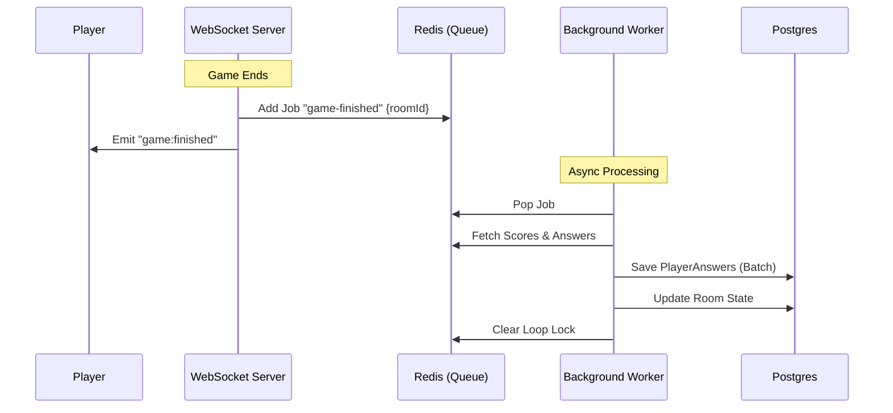

### Phase E: Background Worker (New)

1.  **Game Ends (WebSocket)**
    -   When `finishGame` is called in `apps/ws`, instead of calling the HTTP API directly, it adds a job:
    -   **Queue**: `game-events`
    -   **Job**: `game-finished`
    -   **Payload**: `{ roomId }`

2.  **Worker Processing (apps/worker)**
    -   The dedicated worker listens to `game-events`.
    -   It picks up the job and executes the heavy lifting:
        -   Fetches scores and answers from Redis.
        -   Batch inserts `PlayerAnswer` records to Postgres.
        -   Updates `RoomPlayer` scores.
        -   Sets Room state to `FINISHED`.

3.  **Benefits**
    -   **Reliability**: Even if the WS server restarts or the host disconnects, the job is persisted in Redis and *will* run.
    -   **Performance**: The heavy DB writes happen in a separate process, keeping the game server fast.

### Updated Diagram

