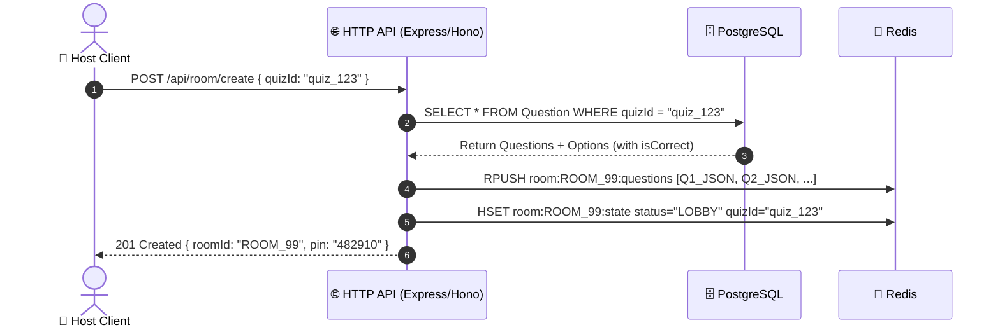
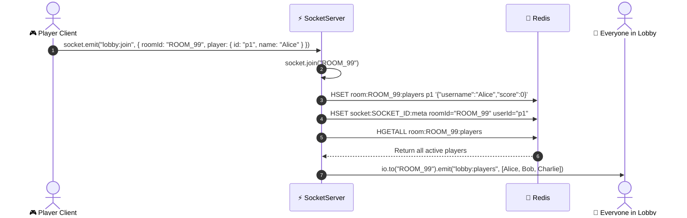
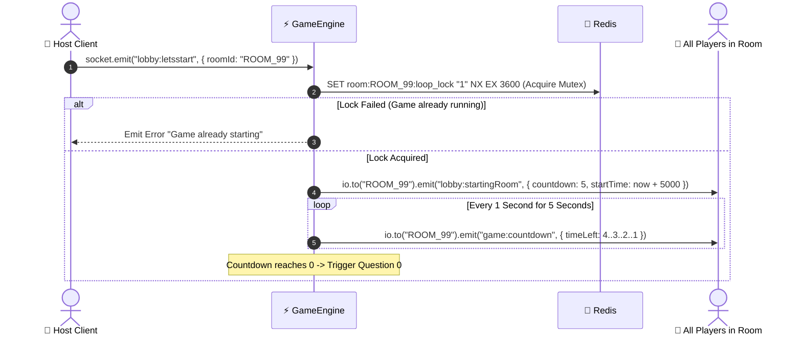
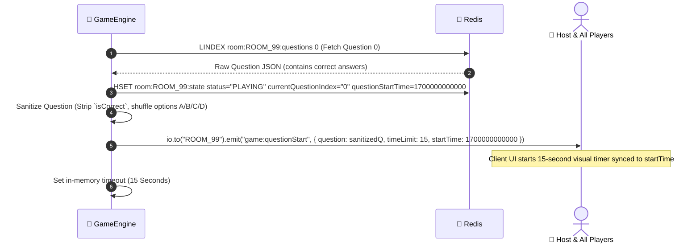
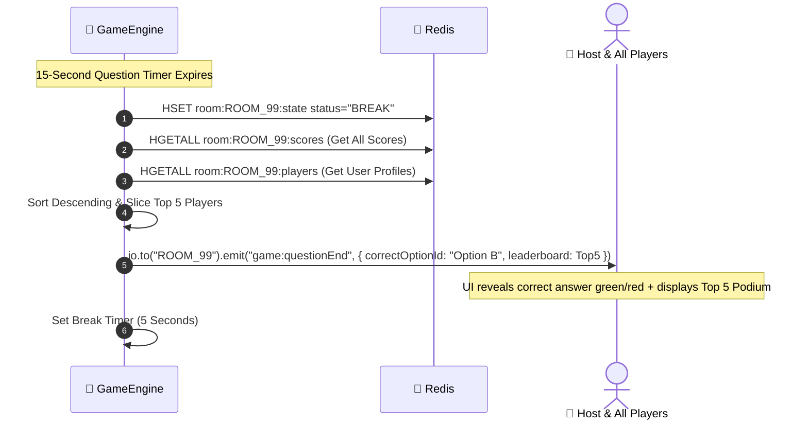
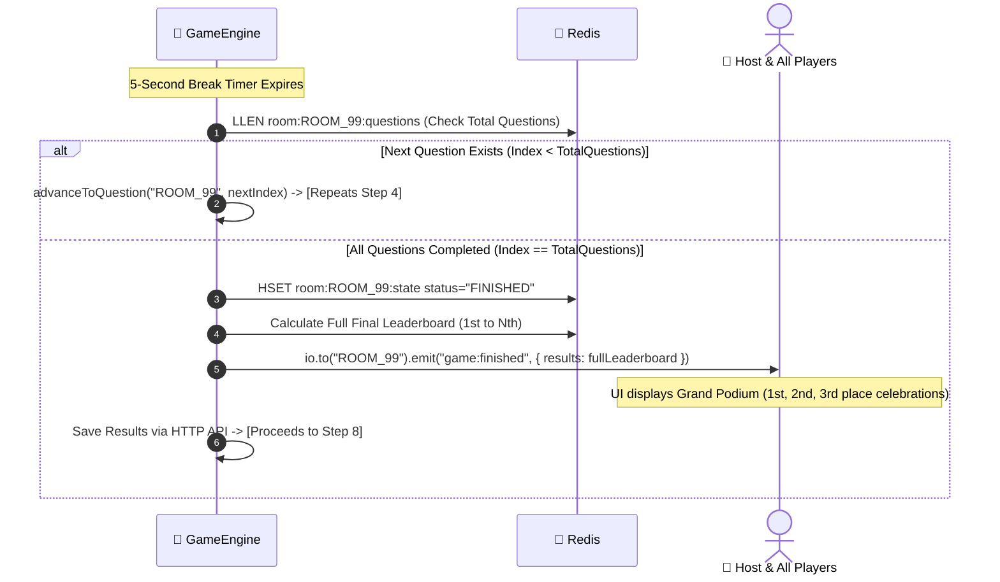
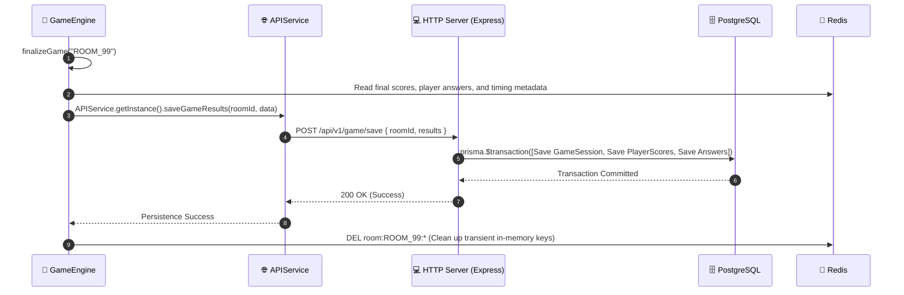
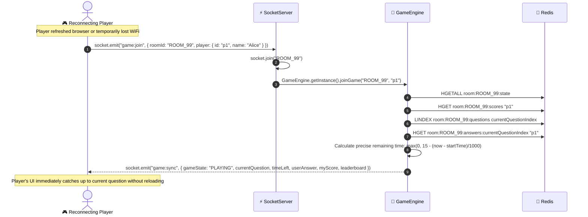

# 🚀 QuizMaster Turbo — WebSocket Engine Architecture & Singleton Deep Dive

> **Document Type:** System Audit, Architecture Refactor & Live Game Engine Blueprint  
> **Target Package:** `apps/ws`  
> **Audience:** Core Engineers & Full-Stack Developers  
> **Status:** Recommended Architectural Specification  

---

## 📑 Table of Contents

- [🚀 QuizMaster Turbo — WebSocket Engine Architecture \& Singleton Deep Dive](#-quizmaster-turbo--websocket-engine-architecture--singleton-deep-dive)
	- [📑 Table of Contents](#-table-of-contents)
	- [1. Executive Summary \& Current Codebase Audit](#1-executive-summary--current-codebase-audit)
		- [Current File Structure](#current-file-structure)
	- [2. Complete Gap Analysis \& Identified Vulnerabilities](#2-complete-gap-analysis--identified-vulnerabilities)
		- [2.1 Severe Concurrency \& State Inconsistencies](#21-severe-concurrency--state-inconsistencies)
		- [2.2 Memory Leaks \& Redis Anti-Patterns](#22-memory-leaks--redis-anti-patterns)
		- [2.3 Lack of Type Safety \& Fragile Handlers](#23-lack-of-type-safety--fragile-handlers)
		- [2.4 Horizontal Scaling \& Clustering Bottlenecks](#24-horizontal-scaling--clustering-bottlenecks)
	- [3. The Singleton Pattern: Strategy, Libraries \& Implementation](#3-the-singleton-pattern-strategy-libraries--implementation)
		- [3.1 Why Singleton Pattern in WebSocket Services?](#31-why-singleton-pattern-in-websocket-services)
		- [3.2 Recommended Libraries \& Tools](#32-recommended-libraries--tools)
		- [3.3 Singleton 1: `RedisManager` (Connection Pooling \& Pub/Sub)](#33-singleton-1-redismanager-connection-pooling--pubsub)
		- [3.4 Singleton 2: `SocketServer` (Typed Gateway \& Lifecycle)](#34-singleton-2-socketserver-typed-gateway--lifecycle)
		- [3.5 Singleton 3: `GameEngine` (Authoritative Game State Machine)](#35-singleton-3-gameengine-authoritative-game-state-machine)
		- [3.6 Singleton 4: `APIService` (HTTP API Results Saver)](#36-singleton-4-apiservice-http-api-results-saver)
	- [4. Proposed Directory Restructuring](#4-proposed-directory-restructuring)
	- [5. Step-by-Step Visual Diagrams: How the Live Game Works](#5-step-by-step-visual-diagrams-how-the-live-game-works)
		- [Step 1: Room Creation \& Question Pre-Loading](#step-1-room-creation--question-pre-loading)
		- [Step 2: Player Connects \& Joins Lobby](#step-2-player-connects--joins-lobby)
		- [Step 3: Host Starts Game \& Synchronized Countdown](#step-3-host-starts-game--synchronized-countdown)
		- [Step 4: Active Question Delivery \& Timing Sync](#step-4-active-question-delivery--timing-sync)
		- [Step 5: Player Submits Answer (Atomic Lua Script)](#step-5-player-submits-answer-atomic-lua-script)
		- [Step 6: Question Conclusion, Answer Reveal \& Leaderboard](#step-6-question-conclusion-answer-reveal--leaderboard)
		- [Step 7: Next Question Loop vs Game Finalization](#step-7-next-question-loop-vs-game-finalization)
		- [Step 8: API-Based Database Persistence via APIService](#step-8-api-based-database-persistence-via-apiservice)
		- [Step 9: Mid-Game Player Reconnection \& State Catch-Up](#step-9-mid-game-player-reconnection--state-catch-up)
	- [6. Redis Data Structures \& Key Schemas](#6-redis-data-structures--key-schemas)
	- [7. Full Implementation Code Reference](#7-full-implementation-code-reference)
		- [7.1 Strongly-Typed Events (`events.types.ts`)](#71-strongly-typed-events-eventstypests)
		- [7.2 Production `RedisManager.ts`](#72-production-redismanagerts)
		- [7.3 Atomic Lua Script (`submit_answer.lua`)](#73-atomic-lua-script-submit_answerlua)
		- [7.4 Production `SocketServer.ts`](#74-production-socketserverts)
		- [7.5 Production `GameEngine.ts`](#75-production-gameenginets)
	- [8. Migration \& Action Checklist](#8-migration--action-checklist)

---

## 1. Executive Summary & Current Codebase Audit

The `apps/ws` package serves as the real-time synchronization engine of QuizMaster Turbo. It manages player lobbies, coordinates quiz games, accepts real-time answer submissions, calculates scores, and persists results directly via the main HTTP API server.

### Current File Structure

```
apps/ws/
├── src/
│   ├── config.ts                  # Loads .env from workspace root
│   ├── index.ts                   # Express app + HTTP server creation
│   ├── socket.ts                  # io initialization, CORS, admin-ui, graceful shutdown
│   ├── types/
│   │   └── socket.types.ts        # Loose interface definitions
│   ├── handler/
│   │   ├── connction.ts           # Typo in filename; binds lobby/game event listeners
│   │   └── disconnect.ts          # Disconnect cleanup for lobby only
│   ├── events/
│   │   ├── lobby.event.ts         # lobby:join, lobby:leave, lobby:letsstart
│   │   └── game.event.ts          # game:join, game:start, game:submitAnswer
│   └── services/
│       ├── redis.service.ts       # Re-exports redisClient from @repo/redis
│       ├── lobby.service.ts       # Redis HSET/HDEL for lobby players; contains blocking KEYS
│       └── game.service.ts        # 470+ lines monolithic file mixing timers, state, grading, locks
```

---

## 2. Complete Gap Analysis & Identified Vulnerabilities

### 2.1 Severe Concurrency & State Inconsistencies

1. **Non-Atomic Answer Submission (Race Condition & Double Scoring):**
   In `game.service.ts` (`submitAnswer`), grading and score updating are split into 5 distinct Redis roundtrips:
   - `redisClient.hgetall(roomKey:state)`
   - `redisClient.hexists(roomKey:answers:index, userId)`
   - `redisClient.hincrby(roomKey:scores, userId, points)`
   - `redisClient.hset(roomKey:answers:index, userId, answer)`
   - `redisClient.hget(roomKey:scores, userId)`

   > [!CAUTION]
   > **Vulnerability:** If a client fires 5 concurrent socket messages in the same millisecond (e.g., automated script), all 5 requests pass the `hexists` check before `hset` executes, awarding **$5 \times \text{points}$** for a single question.

2. **In-Memory `setTimeout` / `setInterval` Dependency:**
   - The game progression (`countdown -> nextQuestion -> endQuestion -> nextQuestion`) is driven strictly by Node's internal `setTimeout` in `game.service.ts`.
   - If the Node process restarts, deploys, or crashes, **all active games freeze permanently** with Redis keys remaining locked.
   - Timers run inside a single process. In a cluster with multiple workers/pods, another instance cannot resume an interrupted game loop.

3. **Fragile Concurrency Lock:**
   - `const acquired = await redisClient.set(lockKey, "1", "EX", 3600, "NX");` locks for 1 hour.
   - If the game encounters an unhandled exception midway through question 3, the room remains permanently locked for 1 hour.

---

### 2.2 Memory Leaks & Redis Anti-Patterns

1. **Blocking `KEYS` Command in Production (`lobby.service.ts`):**
   ```typescript
   // ❌ CRITICAL ANTI-PATTERN in lobby.service.ts (Line 34)
   export async function removePlayerBySocket(socketId: string) {
       const keys = await redis.keys("room:*:players"); // ⛔ BLOCKS REDIS EVENT LOOP
       for (const key of keys) {
           const players = await redis.hgetall(key);
           // ...
       }
   }
   ```
   > [!WARNING]
   > `redis.keys()` is an $O(N)$ synchronous blocking command. On a production Redis instance with thousands of active keys, this freezes all incoming requests across all services (HTTP, WS, Worker), causing latency spikes and dropped socket connections.

2. **Eliminated Connection Overhead (No Database Client in WebSocket Engine):**
   - We completely avoid running a database client or Prisma in the WebSocket process.
   - Database operations are decoupled and performed by calling the HTTP API server's `/api/v1/game/save` endpoint, saving database connection pools for the main server.

3. **Incomplete TTL Expirations:**
   - TTLs (`expire(key, 3600)`) are applied sequentially after write operations. If a process dies between `hset` and `expire`, keys remain in Redis indefinitely as zombie data.

---

### 2.3 Lack of Type Safety & Fragile Handlers

1. **Pervasive Use of `any` Types:**
   - Socket handlers use `(io: any, socket: any)`.
   - Event parameters receive untyped objects, removing compile-time validation for client payloads.
   - Return objects from Redis parsing (`JSON.parse(...)`) are unvalidated, risking runtime `TypeError: Cannot read properties of undefined`.

2. **Typo in Core Filename:**
   - `src/handler/connction.ts` is misspelled (missing `e`).

3. **Inconsistent Question Schema Handling:**
   - `game.service.ts` includes defensive fallbacks like `question.questionText || question.text`, `Option.map(...) || question.options`, `question.correct || question.correctOptionId`.
   - This indicates schema divergence between how the HTTP server seeds questions into Redis and how the WS server expects them.

4. **Incomplete Disconnect Flow:**
   - When a user disconnects while playing (`location === "room"`), `disconnect.ts` has `// handleRoomLeave(socket);` commented out.
   - The game never cleans up active player socket maps during gameplay, preventing proper disconnected status indicators on the leaderboard.

---

### 2.4 Horizontal Scaling & Clustering Bottlenecks

1. **No Socket.IO Adapter Configured:**
   - Currently, `io` broadcasts (`io.to(roomId).emit(...)`) are strictly local to that single Node.js process.
   - As soon as you run 2 instances (e.g. on Render, Kubernetes, or ECS with a load balancer), Player A on Instance 1 will **never receive events** emitted by Player B on Instance 2.

---

## 3. The Singleton Pattern: Strategy, Libraries & Implementation

### 3.1 Why Singleton Pattern in WebSocket Services?

In a real-time event-driven architecture, services must maintain **exactly one authoritative instance** for:
- **Socket Server Gateway (`SocketServer`):** Manages rooms, middleware, and broadcast channels.
- **Connection Pools (`RedisManager`):** Prevents connection leaks, manages primary client, pub/sub subscriber, and pub/sub publisher singletons.
- **Game Engine Coordinator (`GameEngine`):** Centralizes game state transitions, timer handles, scoring rules, and lock acquisitions.
- **API Client (`APIService`):** Centralizes HTTP REST API requests to persist finished game results to the main database server.

### 3.2 Recommended Libraries & Tools

| Library / Tool | Purpose | Why It's Best-in-Class |
| :--- | :--- | :--- |
| **`ioredis`** | Redis Client | Native support for clusters, sentinel, pipelines, and Lua scripting. |
| **`@socket.io/redis-adapter`** | Horizontal Scaling | Broadcasts socket events seamlessly across multiple WS server instances via Redis Pub/Sub. |
| **`zod`** | Schema Validation | Validates incoming socket payloads at runtime with TypeScript type inference. |
| **`global fetch`** | HTTP Client | Built-in Node.js global fetch for lightweight REST API requests. |
| **Native TypeScript Singleton Class** | Structural Pattern | Standard `private static instance`, zero external runtime dependency, complete control over initialization and teardown. |

---

### 3.3 Singleton 1: `RedisManager` (Connection Pooling & Pub/Sub)

Manages three distinct Redis connections:
1. **`client`**: For standard key-value, hashes, sorted sets, and transactions.
2. **`subClient`**: Dedicated subscriber connection for Socket.IO Redis Adapter.
3. **`pubClient`**: Dedicated publisher connection for Socket.IO Redis Adapter.

```
                     +---------------------------------------+
                     |         RedisManager.getInstance()    |
                     +---------------------------------------+
                                    |        |       |
            +-----------------------+        |       +-----------------------+
            |                                |                               |
            v                                v                               v
     [Primary Client]               [PubClient (Adapter)]           [SubClient (Adapter)]
   (Commands, Hashes, Lua)             (Socket Broadcasts)             (Socket Receives)
```

---

### 3.4 Singleton 2: `SocketServer` (Typed Gateway & Lifecycle)

Centralized class wrapping Socket.IO with:
- Strongly typed events (`ClientToServerEvents`, `ServerToClientEvents`, `InterServerEvents`, `SocketData`).
- Integrated CORS and Redis Adapter setup.
- Authentication/Handshake middleware.
- Graceful shutdown orchestration.

---

### 3.5 Singleton 3: `GameEngine` (Authoritative Game State Machine)

Manages:
- Distributed locks using atomic Redis transactions.
- Server-authoritative timing calculations (`startTime`, `serverTime`, `duration`).
- Answer evaluation via atomic Lua script execution.
- Real-time leaderboard generation using Redis Hashes.
- Game loop timeouts with active room tracking maps.

---

### 3.6 Singleton 4: `APIService` (HTTP API Results Saver)

Encapsulates REST API client calls, sending structured POST requests to `/api/v1/game/save` on the HTTP server to record game sessions, player scores, and detailed answers.

---

## 4. Proposed Directory Restructuring

```
apps/ws/
├── src/
│   ├── config/
│   │   └── env.ts                     # Validated environment variables (Zod)
│   ├── constants/
│   │   ├── events.constants.ts        # Socket event name constants
│   │   └── game.constants.ts          # QUESTION_TIME, BREAK_TIME, POINTS
│   ├── core/                          # ⭐ SINGLETONS & ENGINE
│   │   ├── RedisManager.ts            # Singleton: Redis connections & Lua scripts
│   │   ├── SocketServer.ts            # Singleton: Typed Socket.IO server & Adapter
│   │   ├── GameEngine.ts              # Singleton: Authoritative Game Loop & Logic
│   │   ├── APIService.ts              # Singleton: HTTP API Client / Results Saver
│   ├── handlers/                      # Socket connection & disconnect routing
│   │   ├── connection.handler.ts      # (Fixed typo) Connection entry point
│   │   └── disconnect.handler.ts      # Granular disconnect & reconnection handling
│   ├── listeners/                     # Modular event listeners
│   │   ├── lobby.listener.ts          # Lobby joining, ready state, host start
│   │   └── game.listener.ts           # Game joining, sync, answer submission
│   ├── lua/                           # 🚀 High-performance atomic Redis scripts
│   │   └── submit_answer.lua          # Atomic answer check, grading, and score update
│   ├── schemas/                       # Runtime Zod validation schemas
│   │   ├── lobby.schema.ts
│   │   └── game.schema.ts
│   ├── types/                         # Strict TypeScript definitions
│   │   ├── events.types.ts            # Typed Server-Client Socket.IO events
│   │   └── game.types.ts              # Game state, questions, player, payload interfaces
│   └── index.ts                       # Clean bootstrap entry point
```

---

## 5. Step-by-Step Visual Diagrams: How the Live Game Works

To make each part crystal clear, here is a **dedicated step-by-step diagram for each individual action in the game**.

---

### Step 1: Room Creation & Question Pre-Loading

**What happens:** The host creates a game via the HTTP REST API. The API fetches questions from PostgreSQL, pre-loads them into Redis, sets the room state to `"LOBBY"`, and returns the join PIN.



- **Redis Keys Created:**
  - `room:ROOM_99:questions` $\to$ List of serialized questions.
  - `room:ROOM_99:state` $\to$ Hash `{ status: "LOBBY", quizId: "quiz_123" }`.

---

### Step 2: Player Connects & Joins Lobby

**What happens:** Players join with their PIN/Room ID. The WebSocket server saves the player in Redis and immediately broadcasts the updated player roster to everyone in the room.



- **Redis Keys Modified:**
  - `room:ROOM_99:players` $\to$ Hash of `userId` $\to$ Player metadata JSON.
  - `socket:SOCKET_ID:meta` $\to$ Reverse lookup for $O(1)$ fast disconnect cleanup.

---

### Step 3: Host Starts Game & Synchronized Countdown

**What happens:** The host clicks "Start Game". `GameEngine` acquires a distributed lock in Redis to prevent duplicate starts, then broadcasts a synchronized 5-second countdown to all players.



- **Redis Keys Modified:**
  - `room:ROOM_99:loop_lock` $\to$ Set with `NX EX 3600` mutex lock.

---

### Step 4: Active Question Delivery & Timing Sync

**What happens:** `GameEngine` loads Question 0 from Redis, sanitizes it (removes `isCorrect` so players cannot cheat via DevTools), records the server start time, and broadcasts the question.



- **Redis Keys Modified:**
  - `room:ROOM_99:state` $\to$ Updated to `status: "PLAYING"`, `currentQuestionIndex: "0"`, `questionStartTime: "1700000000000"`.

---

### Step 5: Player Submits Answer (Atomic Lua Script)

**What happens:** When a player taps an option, an atomic Redis Lua script checks if the game is still playing, ensures the player hasn't already answered, grades the choice (+4 or -1), and updates the score in a single atomic transaction.

```mermaid
sequenceDiagram
    autonumber
    actor Player as 🎮 Player (Alice)
    participant WS as ⚡ SocketServer
    participant GE as 🧠 GameEngine
    participant Lua as ⚡ Redis Lua Engine
    actor Room as 👥 Other Players in Room

    Player->>WS: socket.emit("game:submitAnswer", { roomId: "ROOM_99", answer: "Option B", timeTaken: 2300 })
    WS->>GE: GameEngine.getInstance().submitAnswer(...)
    GE->>Lua: EVALSHA submit_answer.lua [keys: state, scores, answers:0, meta:0] [args: "p1", "Option B", "Option B", 2300, 4, -1]
    
    rect rgb(30, 41, 59)
        Note over Lua: Atomic Execution Inside Redis Engine
        Lua->>Lua: 1. Verify state == "PLAYING"
        Lua->>Lua: 2. Check HEXISTS answers:0 "p1" == 0 (Not answered yet)
        Lua->>Lua: 3. Is "Option B" == "Option B"? (True -> +4 points)
        Lua->>Lua: 4. HINCRBY scores "p1" 4
        Lua->>Lua: 5. HSET answers:0 "p1" "Option B"
        Lua->>Lua: 6. HSET meta:0 "p1" 2300
    end
    
    Lua-->>GE: Return JSON { success: true, isCorrect: true, points: 4, newScore: 24 }
    GE-->>WS: Return result
    WS-->>Player: socket.emit("game:answerResult", { isCorrect: true, points: 4, newScore: 24 })
    WS->>Room: socket.to("ROOM_99").emit("game:playerAnswered", { userId: "p1" })
```



- **Redis Keys Modified:**
  - `room:ROOM_99:scores` $\to$ Incremented by +4 (or -1).
  - `room:ROOM_99:answers:0` $\to$ Saved submitted answer for user `"p1"`.
  - `room:ROOM_99:answers_meta:0` $\to$ Saved `timeTaken: 2300` ms.

---

### Step 6: Question Conclusion, Answer Reveal & Leaderboard

**What happens:** When the 15-second timer expires, `GameEngine` switches state to `"BREAK"`, compiles the Top 5 leaderboard, reveals the correct option, and gives players a 5-second breather.



- **Redis Keys Modified:**
  - `room:ROOM_99:state` $\to$ Updated to `status: "BREAK"`.

---

### Step 7: Next Question Loop vs Game Finalization

**What happens:** After the 5-second break, `GameEngine` checks if there are more questions. If yes, it loads the next question (loops back to Step 4). If no, it marks the game as `"FINISHED"` and emits the final grand podium.



---

### Step 8: API-Based Database Persistence via APIService

**What happens:** When the game concludes, `GameEngine` reads final scores, player answers, and timing metadata from Redis. It calls `APIService` to post this structured game payload to the HTTP Server (`POST /api/v1/game/save`), which executes the PostgreSQL transactions, and then cleans up transient Redis keys.



---

### Step 9: Mid-Game Player Reconnection & State Catch-Up

**What happens:** If a player refreshes their browser or loses internet for 3 seconds, they emit `game:join`. `GameEngine` computes the exact remaining time and whether they already answered, syncing their screen seamlessly without missing a beat.



---

## 6. Redis Data Structures & Key Schemas

| Key Pattern | Redis Type | Purpose | TTL |
| :--- | :--- | :--- | :--- |
| `room:{roomId}:state` | `HASH` | Holds `status`, `currentQuestionIndex`, `questionStartTime`, `quizId` | 2 Hours |
| `room:{roomId}:questions` | `LIST` | Array of JSON strings representing questions & answers | 2 Hours |
| `room:{roomId}:players` | `HASH` | Mapping of `userId` $\to$ JSON `{ username, avatar, socketId }` | 2 Hours |
| `room:{roomId}:scores` | `HASH` | Mapping of `userId` $\to$ integer score for ranking | 2 Hours |
| `room:{roomId}:answers:{qIdx}` | `HASH` | Mapping of `userId` $\to$ submitted option string | 2 Hours |
| `room:{roomId}:answers_meta:{qIdx}` | `HASH` | Mapping of `userId` $\to$ `timeTaken` in milliseconds | 2 Hours |
| `room:{roomId}:loop_lock` | `STRING` | Distributed mutex lock preventing duplicate game loops | 1 Hour |
| `socket:{socketId}:meta` | `HASH` | Reverse mapping: `socketId` $\to$ `{ roomId, userId, role }` | 2 Hours |

---

## 7. Full Implementation Code Reference

### 7.1 Strongly-Typed Events (`events.types.ts`)

```typescript
// apps/ws/src/types/events.types.ts

export interface PlayerData {
	id: string;
	name: string;
	avatar?: string;
	score?: number;
}

export interface LeaderboardEntry {
	userId: string;
	name: string;
	avatar?: string;
	score: number;
	rank?: number;
}

export interface QuestionClientPayload {
	id: string;
	text: string;
	options: string[];
	imageUrl?: string;
}

// Client to Server
export interface ClientToServerEvents {
	"lobby:join": (payload: { roomId: string; player: PlayerData }) => void;
	"lobby:leave": (payload: { roomId: string; playerId: string }) => void;
	"lobby:letsstart": (payload: { roomId: string }) => void;
	"game:join": (payload: { roomId: string; player: PlayerData }) => void;
	"game:submitAnswer": (payload: {
		roomId: string;
		answer: string;
		timeTaken: number;
	}) => void;
	"game:ping": () => void;
}

// Server to Client
export interface ServerToClientEvents {
	"lobby:players": (players: Record<string, any>) => void;
	"lobby:startingRoom": (data: { countdown: number; startTime: number }) => void;
	"game:countdown": (data: { timeLeft: number }) => void;
	"game:questionStart": (data: {
		question: QuestionClientPayload;
		questionIndex: number;
		totalQuestions: number;
		timeLimit: number;
		startTime: number;
	}) => void;
	"game:answerResult": (data: {
		isCorrect: boolean;
		points: number;
		newScore: number;
	}) => void;
	"game:playerAnswered": (data: { userId: string }) => void;
	"game:questionEnd": (data: {
		correctOptionId: string;
		leaderboard: LeaderboardEntry[];
	}) => void;
	"game:finished": (data: { results: LeaderboardEntry[] }) => void;
	"game:sync": (data: any) => void;
	"game:error": (data: { message: string }) => void;
}

export interface InterServerEvents {
	ping: () => void;
}

export interface SocketData {
	userId: string;
	roomId: string;
	username: string;
	avatar: string;
	location: "lobby" | "game";
}
```

---

### 7.2 Production `RedisManager.ts`

```typescript
// apps/ws/src/core/RedisManager.ts

import { Redis } from "ioredis";
import fs from "node:fs";
import path from "node:path";

export class RedisManager {
	private static instance: RedisManager | null = null;
	private client: Redis;
	private subClient: Redis;
	private pubClient: Redis;
	private submitAnswerSha: string | null = null;

	private constructor() {
		const redisUrl = process.env.REDIS_URL;
		const options = {
			maxRetriesPerRequest: null,
			enableReadyCheck: false,
			lazyConnect: false,
			retryStrategy(times: number) {
				return Math.min(times * 100, 3000);
			},
		};

		if (redisUrl) {
			this.client = new Redis(redisUrl, options);
			this.subClient = new Redis(redisUrl, options);
			this.pubClient = new Redis(redisUrl, options);
		} else {
			const host = process.env.REDIS_HOST || "127.0.0.1";
			const port = Number.parseInt(process.env.REDIS_PORT || "6379", 10);
			const password = process.env.REDIS_PASSWORD || undefined;

			this.client = new Redis({ host, port, password, ...options });
			this.subClient = new Redis({ host, port, password, ...options });
			this.pubClient = new Redis({ host, port, password, ...options });
		}

		this.client.on("connect", () => console.log("🟢 [RedisManager] Primary Client connected"));
		this.client.on("error", (err) => console.error("🔴 [RedisManager] Primary Client Error:", err));
	}

	public static getInstance(): RedisManager {
		if (!RedisManager.instance) {
			RedisManager.instance = new RedisManager();
		}
		return RedisManager.instance;
	}

	public getClient(): Redis {
		return this.client;
	}

	public getSubClient(): Redis {
		return this.subClient;
	}

	public getPubClient(): Redis {
		return this.pubClient;
	}

	public async loadLuaScripts(): Promise<void> {
		try {
			const scriptPath = path.resolve(__dirname, "../lua/submit_answer.lua");
			if (fs.existsSync(scriptPath)) {
				const script = fs.readFileSync(scriptPath, "utf-8");
				this.submitAnswerSha = await this.client.script("LOAD", script) as string;
				console.log(`⚡ [RedisManager] Loaded submit_answer.lua (SHA: ${this.submitAnswerSha})`);
			}
		} catch (error) {
			console.warn("⚠️ [RedisManager] Could not load Lua script from file, will use inline eval");
		}
	}

	public getSubmitAnswerSha(): string | null {
		return this.submitAnswerSha;
	}

	public async disconnectAll(): Promise<void> {
		await Promise.all([
			this.client.quit(),
			this.subClient.quit(),
			this.pubClient.quit(),
		]);
		console.log("🛑 [RedisManager] All Redis connections closed cleanly");
	}
}
```

---

### 7.3 Atomic Lua Script (`submit_answer.lua`)

```lua
-- Save to apps/ws/src/lua/submit_answer.lua

-- KEYS:
-- 1: room:{roomId}:state
-- 2: room:{roomId}:scores
-- 3: room:{roomId}:answers:{qIndex}
-- 4: room:{roomId}:answers_meta:{qIndex}

-- ARGV:
-- 1: userId
-- 2: submittedAnswer
-- 3: correctAnswer
-- 4: timeTaken (ms)
-- 5: correctPoints (+4)
-- 6: incorrectPoints (-1)

local stateKey = KEYS[1]
local scoresKey = KEYS[2]
local answersKey = KEYS[3]
local metaKey = KEYS[4]

local userId = ARGV[1]
local submittedAnswer = ARGV[2]
local correctAnswer = ARGV[3]
local timeTaken = ARGV[4]
local correctPoints = tonumber(ARGV[5])
local incorrectPoints = tonumber(ARGV[6])

-- 1. Check if game is in PLAYING state
local status = redis.call('HGET', stateKey, 'status')
if status ~= 'PLAYING' then
    return cjson.encode({ error = 'GAME_NOT_IN_PLAYING_STATE' })
end

-- 2. Check if user already submitted answer for this question
local alreadyAnswered = redis.call('HEXISTS', answersKey, userId)
if alreadyAnswered == 1 then
    return cjson.encode({ error = 'ALREADY_ANSWERED' })
end

-- 3. Grade Answer
local isCorrect = (submittedAnswer == correctAnswer)
local pointsToAdd = isCorrect and correctPoints or incorrectPoints

-- 4. Atomic writes
redis.call('HINCRBY', scoresKey, userId, pointsToAdd)
redis.call('HSET', answersKey, userId, submittedAnswer)
redis.call('HSET', metaKey, userId, timeTaken)

-- 5. Get Updated Score
local newScore = redis.call('HGET', scoresKey, userId)

return cjson.encode({
    success = true,
    isCorrect = isCorrect,
    points = pointsToAdd,
    newScore = tonumber(newScore)
})
```

---

### 7.4 Production `SocketServer.ts`

```typescript
// apps/ws/src/core/SocketServer.ts

import type http from "node:http";
import { createAdapter } from "@socket.io/redis-adapter";
import { instrument } from "@socket.io/admin-ui";
import { Server } from "socket.io";
import { RedisManager } from "./RedisManager.js";
import type {
	ClientToServerEvents,
	ServerToClientEvents,
	InterServerEvents,
	SocketData,
} from "../types/events.types.js";
import { registerConnectionHandlers } from "../handlers/connection.handler.js";

export class SocketServer {
	private static instance: SocketServer | null = null;
	private io: Server<
		ClientToServerEvents,
		ServerToClientEvents,
		InterServerEvents,
		SocketData
	>;

	private constructor(httpServer: http.Server) {
		const redisManager = RedisManager.getInstance();
		const pubClient = redisManager.getPubClient();
		const subClient = redisManager.getSubClient();

		this.io = new Server(httpServer, {
			path: "/socket.io/",
			adapter: createAdapter(pubClient, subClient),
			cors: {
				origin: [
					"https://admin.socket.io",
					"http://localhost:3000",
					"https://quiz-master-turbo-quiz-master.vercel.app",
					"https://quizmaster.zynito.in",
					"http://quizmaster.zynito.in",
				],
				methods: ["GET", "POST"],
				credentials: true,
			},
			transports: ["websocket", "polling"],
			allowUpgrades: true,
			pingTimeout: 60000,
			pingInterval: 25000,
		});

		instrument(this.io, { auth: false });

		this.io.on("connection", (socket) => {
			registerConnectionHandlers(this.io, socket);
		});

		this.setupGracefulShutdown(httpServer);
	}

	public static initialize(httpServer: http.Server): SocketServer {
		if (!SocketServer.instance) {
			SocketServer.instance = new SocketServer(httpServer);
			console.log("⚡ [SocketServer] Singleton initialized with Redis Adapter");
		}
		return SocketServer.instance;
	}

	public static getInstance(): SocketServer {
		if (!SocketServer.instance) {
			throw new Error("SocketServer has not been initialized. Call initialize(httpServer) first.");
		}
		return SocketServer.instance;
	}

	public getIO(): Server<
		ClientToServerEvents,
		ServerToClientEvents,
		InterServerEvents,
		SocketData
	> {
		return this.io;
	}

	private setupGracefulShutdown(httpServer: http.Server): void {
		const shutdown = async () => {
			console.log("\n🛑 Graceful shutdown initiated...");
			this.io.close(async () => {
				console.log("✅ Socket.IO server closed");
				await RedisManager.getInstance().disconnectAll();
				httpServer.close(() => {
					console.log("✅ HTTP server closed. Exiting process.");
					process.exit(0);
				});
			});
		};

		process.on("SIGINT", shutdown);
		process.on("SIGTERM", shutdown);
	}
}
```

---

### 7.5 Production `GameEngine.ts`

```typescript
// apps/ws/src/core/GameEngine.ts

import { RedisManager } from "./RedisManager.js";
import { SocketServer } from "./SocketServer.js";
import { APIService } from "./APIService.js";
import type { LeaderboardEntry } from "../types/events.types.js";

const QUESTION_TIME = 15; // Seconds
const BREAK_TIME = 5;      // Seconds
const COUNTDOWN_TIME = 5;  // Seconds

export class GameEngine {
	private static instance: GameEngine | null = null;
	private activeTimers: Map<string, NodeJS.Timeout> = new Map();

	private constructor() {}

	public static getInstance(): GameEngine {
		if (!GameEngine.instance) {
			GameEngine.instance = new GameEngine();
		}
		return GameEngine.instance;
	}

	public async startGame(roomId: string): Promise<boolean> {
		const redis = RedisManager.getInstance().getClient();
		const io = SocketServer.getInstance().getIO();
		const roomKey = `room:${roomId}`;
		const lockKey = `${roomKey}:loop_lock`;

		const acquired = await redis.set(lockKey, "1", "EX", 3600, "NX");
		if (!acquired) {
			console.warn(`[GameEngine] Room ${roomId} is already active or locked.`);
			return false;
		}

		const questionCount = await redis.llen(`${roomKey}:questions`);
		if (questionCount === 0) {
			await redis.del(lockKey);
			io.to(roomId).emit("game:error", { message: "No questions loaded for this room" });
			return false;
		}

		let countdown = COUNTDOWN_TIME;
		io.to(roomId).emit("lobby:startingRoom", {
			countdown,
			startTime: Date.now() + countdown * 1000,
		});

		const interval = setInterval(async () => {
			countdown--;
			if (countdown > 0) {
				io.to(roomId).emit("game:countdown", { timeLeft: countdown });
			} else {
				clearInterval(interval);
				await this.advanceToQuestion(roomId, 0);
			}
		}, 1000);

		return true;
	}

	public async advanceToQuestion(roomId: string, index: number): Promise<void> {
		const redis = RedisManager.getInstance().getClient();
		const io = SocketServer.getInstance().getIO();
		const roomKey = `room:${roomId}`;

		const questions = await redis.lrange(`${roomKey}:questions`, 0, -1);
		if (index >= questions.length) {
			await this.finalizeGame(roomId);
			return;
		}

		const rawQuestion = questions[index];
		if (!rawQuestion) return;
		const question = JSON.parse(rawQuestion);

		const startTime = Date.now();
		await redis.hset(`${roomKey}:state`, {
			status: "PLAYING",
			currentQuestionIndex: index.toString(),
			questionStartTime: startTime.toString(),
		});
		await redis.expire(`${roomKey}:state`, 7200);

		let options: string[] = [];
		if (Array.isArray(question.Option)) {
			options = question.Option.map((o: any) => o.text);
		} else if (Array.isArray(question.options)) {
			options = [...question.options];
		}

		io.to(roomId).emit("game:questionStart", {
			question: {
				id: question.id || index.toString(),
				text: question.questionText || question.text,
				options: options.sort(() => Math.random() - 0.5),
				imageUrl: question.imageUrl,
			},
			questionIndex: index,
			totalQuestions: questions.length,
			timeLimit: QUESTION_TIME,
			startTime,
		});

		const timer = setTimeout(async () => {
			await this.concludeQuestion(roomId, index, question);
		}, QUESTION_TIME * 1000);

		this.activeTimers.set(`${roomId}:question`, timer);
	}

	private async concludeQuestion(roomId: string, index: number, question: any): Promise<void> {
		const redis = RedisManager.getInstance().getClient();
		const io = SocketServer.getInstance().getIO();
		const roomKey = `room:${roomId}`;

		await redis.hset(`${roomKey}:state`, "status", "BREAK");

		const leaderboard = await this.getLeaderboard(roomId, 5);

		let correctText = "";
		if (question.Option) {
			const correctObj = question.Option.find((o: any) => o.isCorrect);
			correctText = correctObj ? correctObj.text : "";
		} else {
			correctText = question.correct || question.correctOptionId || "";
		}

		io.to(roomId).emit("game:questionEnd", {
			correctOptionId: correctText,
			leaderboard,
		});

		const breakTimer = setTimeout(async () => {
			await this.advanceToQuestion(roomId, index + 1);
		}, BREAK_TIME * 1000);

		this.activeTimers.set(`${roomId}:break`, breakTimer);
	}

	public async submitAnswer(data: {
		roomId: string;
		userId: string;
		answer: string;
		timeTaken: number;
	}): Promise<{ isCorrect: boolean; points: number; newScore: number } | { error: string }> {
		const redis = RedisManager.getInstance().getClient();
		const roomKey = `room:${data.roomId}`;

		const state = await redis.hgetall(`${roomKey}:state`);
		if (state.status !== "PLAYING") {
			return { error: "Game is not currently accepting answers" };
		}

		const qIndex = Number.parseInt(state.currentQuestionIndex || "0", 10);
		const questionStr = await redis.lindex(`${roomKey}:questions`, qIndex);
		if (!questionStr) return { error: "Question not found" };

		const question = JSON.parse(questionStr);
		let correctText = "";
		if (question.Option) {
			const correctObj = question.Option.find((o: any) => o.isCorrect);
			correctText = correctObj ? correctObj.text : "";
		} else {
			correctText = question.correct || "";
		}

		const sha = RedisManager.getInstance().getSubmitAnswerSha();
		const keys = [
			`${roomKey}:state`,
			`${roomKey}:scores`,
			`${roomKey}:answers:${qIndex}`,
			`${roomKey}:answers_meta:${qIndex}`,
		];
		const args = [
			data.userId,
			data.answer,
			correctText,
			data.timeTaken.toString(),
			"4",
			"-1",
		];

		let resultRaw: string;
		if (sha) {
			resultRaw = await redis.evalsha(sha, keys.length, ...keys, ...args) as string;
		} else {
			resultRaw = await redis.eval(
				`
				local status = redis.call('HGET', KEYS[1], 'status')
				if status ~= 'PLAYING' then return cjson.encode({ error = 'GAME_NOT_PLAYING' }) end
				if redis.call('HEXISTS', KEYS[3], ARGV[1]) == 1 then return cjson.encode({ error = 'ALREADY_ANSWERED' }) end
				local isCorrect = (ARGV[2] == ARGV[3])
				local pts = isCorrect and tonumber(ARGV[5]) or tonumber(ARGV[6])
				redis.call('HINCRBY', KEYS[2], ARGV[1], pts)
				redis.call('HSET', KEYS[3], ARGV[1], ARGV[2])
				redis.call('HSET', KEYS[4], ARGV[1], ARGV[4])
				local sc = redis.call('HGET', KEYS[2], ARGV[1])
				return cjson.encode({ success = true, isCorrect = isCorrect, points = pts, newScore = tonumber(sc) })
				`,
				keys.length,
				...keys,
				...args,
			) as string;
		}

		const parsed = JSON.parse(resultRaw);
		if (parsed.error) return { error: parsed.error };

		return {
			isCorrect: parsed.isCorrect,
			points: parsed.points,
			newScore: parsed.newScore,
		};
	}

	public async finalizeGame(roomId: string): Promise<void> {
		const redis = RedisManager.getInstance().getClient();
		const io = SocketServer.getInstance().getIO();
		const roomKey = `room:${roomId}`;

		await redis.hset(`${roomKey}:state`, "status", "FINISHED");

		const fullLeaderboard = await this.getLeaderboard(roomId);
		io.to(roomId).emit("game:finished", { results: fullLeaderboard });

		try {
			// Retrieve all necessary game metadata, answers, and scores from Redis
			const [scores, players, questions] = await Promise.all([
				redis.hgetall(`${roomKey}:scores`),
				redis.hgetall(`${roomKey}:players`),
				redis.lrange(`${roomKey}:questions`, 0, -1),
			]);

			// Format data and post to API Server
			await APIService.getInstance().saveGameResults(roomId, {
				scores,
				players,
				questions,
			});
			console.log(`💾 [GameEngine] Successfully saved game results for ${roomId} via HTTP API`);
		} catch (err) {
			console.error(`🔴 [GameEngine] Failed to save game results via API for ${roomId}:`, err);
		}

		// Cleanup transient Redis keys
		await redis.del(
			`${roomKey}:state`,
			`${roomKey}:questions`,
			`${roomKey}:players`,
			`${roomKey}:scores`
		);

		setTimeout(async () => {
			await redis.del(`${roomKey}:loop_lock`);
		}, 5000);
	}

	private async getLeaderboard(roomId: string, limit?: number): Promise<LeaderboardEntry[]> {
		const redis = RedisManager.getInstance().getClient();
		const roomKey = `room:${roomId}`;

		const [scores, playersData] = await Promise.all([
			redis.hgetall(`${roomKey}:scores`),
			redis.hgetall(`${roomKey}:players`),
		]);

		const entries: LeaderboardEntry[] = Object.entries(scores).map(([uid, sc]) => {
			const raw = playersData[uid];
			const p = raw ? JSON.parse(raw) : {};
			return {
				userId: uid,
				score: Number.parseInt(sc || "0", 10),
				name: p.username || p.name || `Player_${uid.slice(0, 4)}`,
				avatar: p.avatar,
			};
		});

		entries.sort((a, b) => b.score - a.score);
		return limit ? entries.slice(0, limit) : entries;
	}
}
```

---

## 8. Migration & Action Checklist

- [ ] **Step 1: Install Required Dependencies**
  ```bash
  cd apps/ws
  npm install @socket.io/redis-adapter zod
  ```

- [ ] **Step 2: Create Core Singletons**
  - Implement `src/core/RedisManager.ts` (manages `client`, `subClient`, `pubClient`).
  - Implement `src/core/SocketServer.ts` with Redis Adapter integration.
  - Implement `src/core/GameEngine.ts` to coordinate game state transitions.
  - Implement `src/core/APIService.ts` for saving results via the HTTP API.

- [ ] **Step 3: Atomic Lua Script Integration**
  - Add `src/lua/submit_answer.lua` for atomic grading and prevent multiple submissions.
  - Initialize script pre-loading during server startup in `index.ts`.

- [ ] **Step 4: Fix Anti-Patterns & Typos**
  - Rename `src/handler/connction.ts` to `src/handlers/connection.handler.ts`.
  - Replace blocking `redis.keys("room:*:players")` in lobby service with $O(1)$ reverse lookup map (`socket:{socketId}:meta`).

- [ ] **Step 5: Apply TypeScript Strict Typings**
  - Create `src/types/events.types.ts` and bind strongly-typed interfaces to `Server<ClientToServerEvents, ServerToClientEvents, InterServerEvents, SocketData>`.

- [ ] **Step 6: Refactor Bootstrap Entry Point (`src/index.ts`)**
  - Initialize `RedisManager`, pre-load Lua scripts, and initialize `SocketServer`.

---

> 💡 **Summary:** Implementing this Singleton Architecture gives QuizMaster Turbo enterprise-grade reliability, eliminates race conditions through atomic Redis Lua grading, enables infinite horizontal scaling with `@socket.io/redis-adapter`, and ensures millisecond-accurate synchronized quiz competitions.
